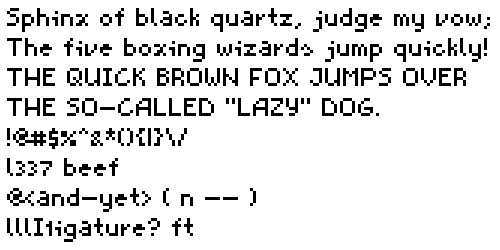

this font implements the ascii character set in [the uf1 format](https://wiki.xxiivv.com/site/ufx_format.html). the character data is in the .icn file, and the length of the spaces is in the file width.txt.

